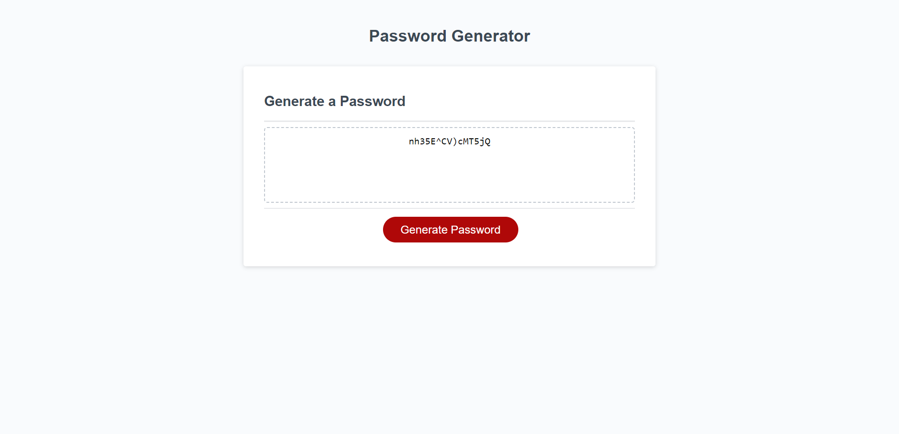

# Password-Generator

## Description

The application is intented to support employees, especially those working with sensitive data, to create strong passwords. According to security experts, passwords are often extremely weak and easy to guess, as demonstrated by "123456" , the most popular password of 2020. Botnet power or brute force can also be implemented to crack open a password if it is too short. 

 The Password-Generator solves this issue by randomly generating secure passwords based on criteria chosen by the user. Password-Generator can generate a unique password from 8-128 characters including both upper and lowercase characters, numerical characters and 16 special characters. The combination of length and diversity is essential for password best practise and as brute force power increases, passwords also need to evolve with ever increasing complexity.
 
 The Password-Generator app runs in the browser and features dynamically updated HTML and CSS powered by JavaScript. The UI is clean and responsive to multiple screen sizes. 

The code uses logic based JavaScript with an initial selection of prompt and confirmation windows which collect the input for the password requirements, stored into variables. Possible characters are indexed into an array and then chosen from the input requiremnts using if statements. Finally the password is generated to it's predetermined length by using iteration and the Math.floor(Math.random() to randomise the characters. The unique password is then displayed on the screen. 

## Usage

A series of prompts is displayed onscreen to elicit desired parameters for the password, including length and character types. These are initiated by clicking the "Generate Password" button. THe generated password is then displayed in the text box, where it can be safely copied by the user. 

        

## Credits

Caroline Helmore chelmore1@bigpond.com

## License

Unliscensed 

